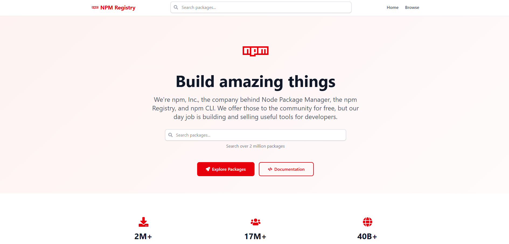

# NPM Registry Explorer

A lightweight web application for exploring every package published to the npm registry.

Built with **React 19**, **TypeScript**, **Vite**, **React Router 7**, and **Tailwind CSS 4**; this project lets you quickly search for any package, inspect its details, and copy installation commands – all from a clean, responsive interface.



---

## ⚡️ Features

- 🔍 **Instant Search** – query the npm registry in real-time and display the first 20 matching results.
- 📦 **Package Details** – versions, description, author, license, dependencies, maintainers, links to repository & homepage, and more.
- ⏱️ **Recent Versions Timeline** – quick glance at the latest releases.
- 🌗 **Responsive UI** – mobile-first design powered by Tailwind CSS.
- 🔗 **Deep Linking** – shareable URLs for both search results and individual packages (React Router).
- ⚙️ **Type-Safe Code** – written entirely in TypeScript with ESLint rules enabled.

---

## 📚 Tech Stack

| Category        | Choice                                             |
| --------------- | --------------------------------------------------- |
| Framework       | [React 19](https://react.dev/)                     |
| Bundler         | [Vite 7](https://vitejs.dev/)                      |
| Language        | TypeScript 5                                       |
| Styling         | [Tailwind CSS 4](https://tailwindcss.com/)         |
| Routing         | [React Router 7](https://reactrouter.com/)         |
| Icons           | [React Icons](https://react-icons.github.io/)      |
| Linting / Types | ESLint, `@typescript-eslint`, `@types/*`           |

---

## 🚀 Getting Started

### Prerequisites

* **Node.js** ≥ 18
* **pnpm**, **yarn**, or **npm** (examples use npm)

### Installation

```bash
# clone the repository
$ git clone https://github.com/<your-username>/npm-registry-explorer.git
$ cd npm-registry-explorer

# install dependencies
$ npm install
```

### Development Server

```bash
$ npm run dev
```
The app will be available at `http://localhost:5173` by default and supports hot module replacement.

### Production Build

```bash
$ npm run build
```
The output static files will be generated in the `dist/` directory.

### Preview Production Build Locally

```bash
$ npm run preview
```

---

## 🗂️ Project Structure

```
├── public/            # Static assets copied as-is
├── src/
│   ├── components/    # Re-usable presentational components
│   ├── pages/         # Route components (Home, Search, Details, Root)
│   ├── index.css      # Tailwind directives & global styles
│   ├── App.tsx        # Router configuration & root component
│   └── main.tsx       # Entry point – React + Tailwind initialisation
└── ...
```

---

## 🤝 Contributing

1. Fork the project
2. Create your feature branch: `git checkout -b feat/amazing-feature`
3. Commit your changes: `git commit -m "feat: add amazing feature"`
4. Push to the branch: `git push origin feat/amazing-feature`
5. Open a pull request

Please make sure any code changes are covered by appropriate tests (if applicable) and follow the existing coding style.

---

## 📄 License

Distributed under the **MIT License**. See [`LICENSE`](LICENSE) for more information.

---

## 🙏 Acknowledgements

- [npm Registry](https://registry.npmjs.org/) API
- [Font Awesome](https://fontawesome.com/) via React Icons